# Demonstrate1.0

## [1.  登录与注册功能]()

点击“立即注册”与“立即登录”即可在两个页面之间相互跳转。

基于信息安全考虑，本系统适配了高安全度密码检测，若不符则警告用户。

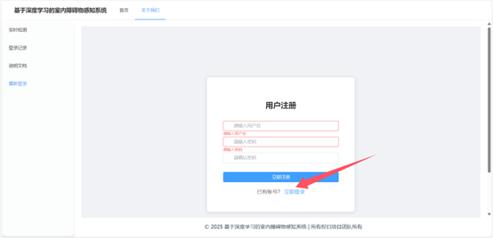

## [2.  历史记录功能]()

在网站中的每个功能性操作都会被记录在操作记录界面，并记录下详细信息与时间以便于研究人员或用户用于其他用途。

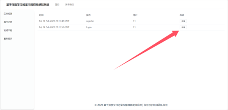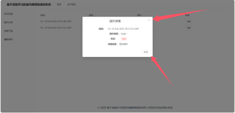

## [3.  手势识别功能]()

基于深度学习与研究成果开发出的手势识别功能，目前可识别七种手势，分别为👍, 👎, ✌️, ☝️, ✊, 👋, 🤟。在识别到手势后会语音提醒用户目标手势，便于用户了解意图。

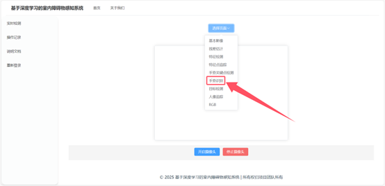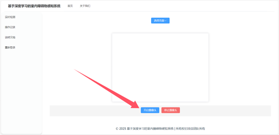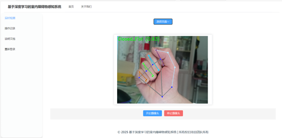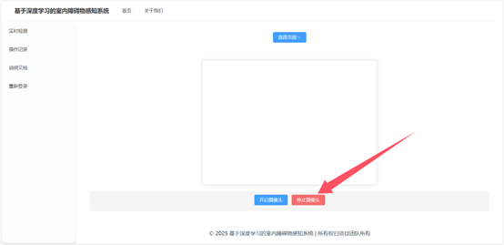

## [4.  特征检测功能]()

选择“特征检测”选项后，可通过调用摄像头标注特征点，面向于研究人员。

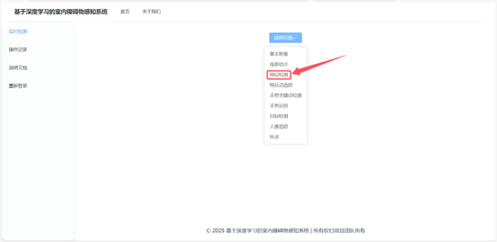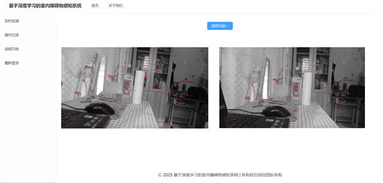

## [5.  特征点追踪功能]()

选择“特征点追踪”选项后，可通过调用摄像头标注特征点，面向于研究人员。

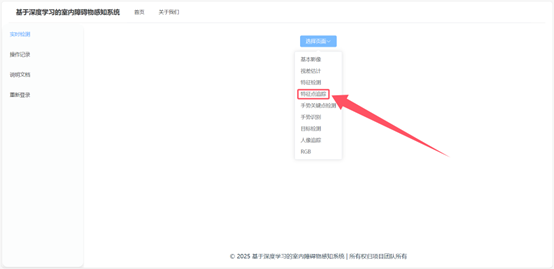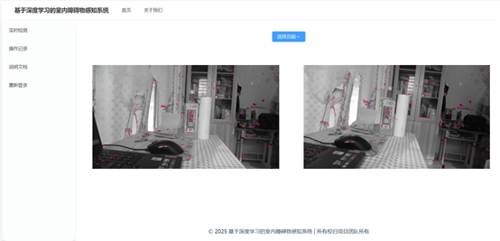

## [6.  视差估计功能]()

通过摄像头视差估计相对距离从而规避障碍物，点击“视差估计”跳转页面。

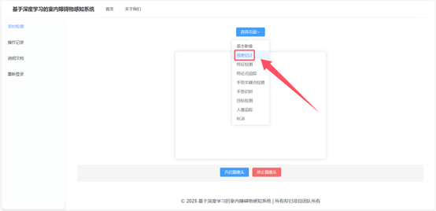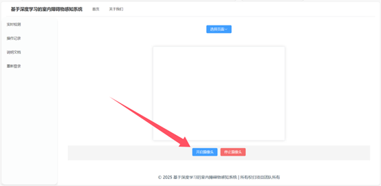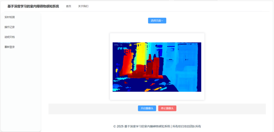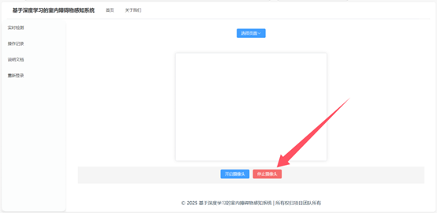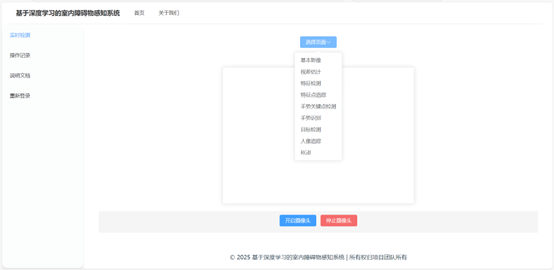
